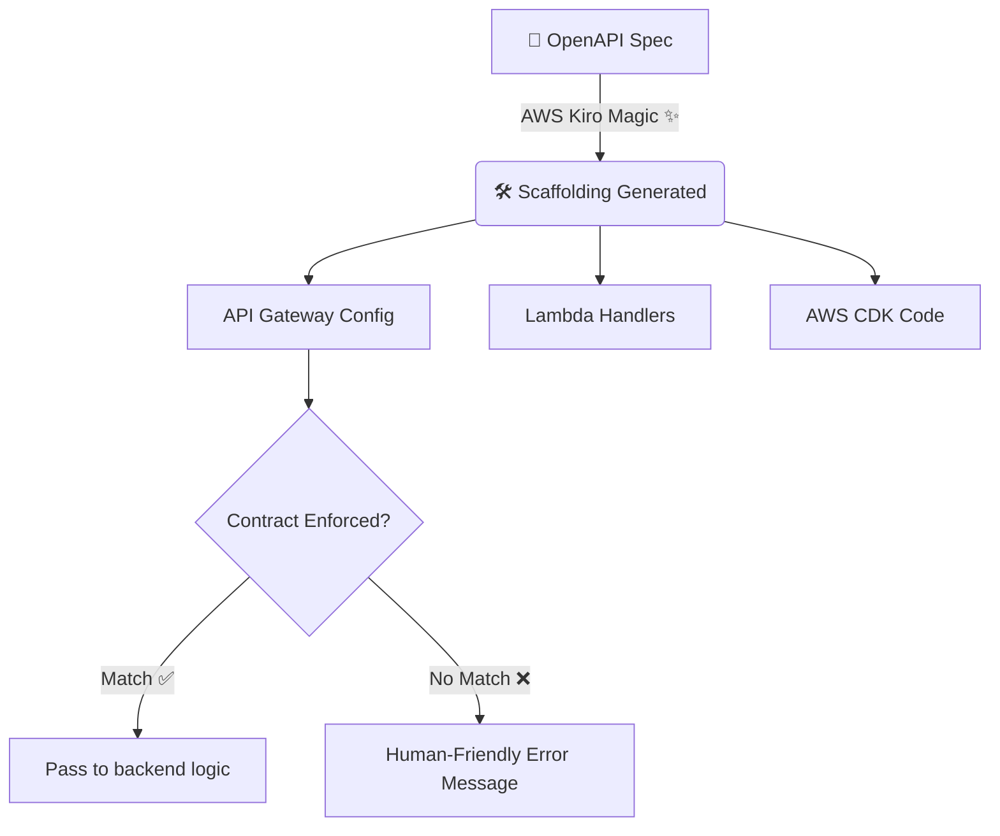

Alright folks, gather around! Today, we're going to talk about something that sounds incredibly dry but is actually a secret superpower for developers: **Spec-Driven Development**.

And to make things even better, we’re looking at it through the lens of a (hypothetical, but super cool sounding) tool called **AWS Kiro**.

If you've ever spent three hours debating the exact payload shape of a `POST` request with your frontend team, you know the pain. Spec-driven development is here to save our sanity, and AWS Kiro is our cape-wearing hero. Let's break down why this approach is going to make your developer life so much easier.

## What is Spec-Driven Development anyway?

Imagine you’re building a house. Do you start blindly nailing two-by-fours together, hoping they eventually form a roof? No! (Or at least, I hope not). You start with a blueprint.

Spec-driven development is exactly that, but for software. You write a specification (like OpenAPI or AsyncAPI) *first*. This document becomes the ultimate source of truth for your entire application.

*(Think of your spec as the blueprint that holds your entire app together!)*

**Why is this awesome? Let's look at the facts:**

*   **Frontend and Backend can actually be friends:** The backend team knows exactly what to build, and the frontend team gets mock data instantly. No more "Hey, did you change the `user_id` to an integer?" surprises on Friday at 4 PM.
*   **Documentation is never out of date:** Because the spec *is* the code, your docs generate themselves. Magic! 🪄
*   **Testing is a breeze:** You can automatically test if your API actually behaves the way it claims it does without writing hundreds of manual assertion lines.

## Enter AWS Kiro 🦸‍♂️

Now, building specs can sometimes feel like doing your taxes. It's necessary, but not exactly a Friday night party. You stare at YAML files until your eyes cross.

AWS Kiro changes the game. Think of it as your friendly neighborhood spec-interpreter.

Instead of just staring at YAML all day, Kiro takes your spec and says, *"Hold my coffee, I've got this."*

### The Kiro Workflow

Here's a quick visual of how Kiro transforms your boring YAML into a living, breathing AWS architecture:

### 1. It Builds the Scaffolding (So You Don't Have To)

With Kiro, you feed it your OpenAPI spec, and *bam*. It spits out your AWS CDK code, your Lambda handlers, your API Gateway configurations... everything.

It's like having a hyper-caffeinated junior developer who types really, really fast and never makes typos. You define the *what*, and Kiro handles the *how* of setting up the AWS plumbing.

### 2. It Enforces the Contract

Kiro acts as a bouncer at the club. If an incoming request doesn't match the VIP list (your spec), it doesn't get in.

If your frontend tries to send a string when the spec demanded a boolean, Kiro stops it at the door. If your backend Lambda tries to return malformed JSON, Kiro flags it before it hits the client. It keeps everyone honest and strictly enforces the rules you set in the blueprint.

### 3. Human-Friendly Error Messages

We've all seen those API errors that look like a cat walked across the keyboard:
`Error 500: Unexpected token < in JSON at position 0`.

*What does that even mean?!*

Kiro looks at the spec and provides errors that actually make sense to a human:
*"Hey buddy, you missed the `email` field in the request body, and it's required. Also, your `age` needs to be an integer."*

## Let's Build Something Slick

Spec-driven development with a tool like AWS Kiro means you spend less time wiring up boilerplate and more time building the actual slick features that users care about.

It forces you to think about the *design* of your application before you write a single line of business logic. It's a bit of medicine up front for a lifetime of health later.

So, the next time you start a project, try writing the spec first. Let the tools do the heavy lifting. It might just save your sanity, and who knows, you might actually have fun doing it! 🚀
