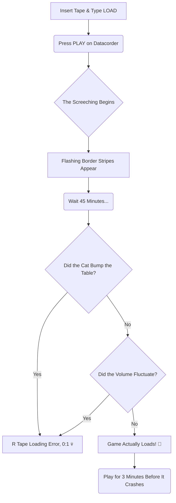

Alright folks, gather around! Today, we're not talking about serverless architecture, AI agents, or high-octane spec-driven development. We are taking a hard left turn down memory lane. We're going back to the 1980s.

To a time when a "loading bar" was a chaotic array of flashing colored stripes, and the soundtrack of our childhood was the unmistakable screech of a data cassette tape.

Yes, my friends, I'm talking about the legendary **ZX Spectrum 128k with the built-in datacorder**.

## The Greatest Christmas Present Ever (For £90)

The story begins one magical Christmas morning. My parents managed to secure the holy grail for my brother and me. They bought it secondhand from our cousin Stuart for the princely sum of around 90 quid.

But the real treasure wasn't just the machine itself. It was the heavy, cardboard box that came with it. This box contained approximately 300 games on cassette tapes.

Let me be clear: *we never bought a single game.* We lived entirely off this glorious, pirated, hand-me-down treasure chest for years.

*(The 80s aesthetic: where computing meant hitting 'Play' and going to make a sandwich.)*

## The Ritual of the Load Screen

If you think waiting 3 seconds for a React app to compile is frustrating, let me educate you on the true meaning of patience.

Loading a game on the Spectrum 128k was a high-stakes ritual. It wasn't just "click and play." Oh no. It went something like this:

You would sit there, holding your breath, listening to the high-pitched digital squealing, watching the border of the TV flash blue and yellow. Forty-five minutes later, the game would finally load... and then instantly crash.

It was maddening. It was beautiful. We loved it.

## The Classics That Shaped Us

Out of those 300 tapes, a few stand out as absolute legends in our household:

### 1. The Star Wars (or was it?) Millennium Falcon Game
To this day, I'm not entirely sure if it was an official Star Wars game or just a game *about* the Millennium Falcon. But it didn't matter. The vector graphics were mind-blowing at the time. You felt like you were actually making the Kessel Run, mostly because navigating the blocky asteroids required Jedi-level reflexes.

### 2. The Epic F1 Manager Simulator
Long before the days of hyper-realistic 3D racing sims, we had text-based F1 management. It was spreadsheets with a steering wheel. You spent hours tweaking suspension settings and tire compounds via green text on a black screen, praying your virtual driver didn't bin it into a wall on lap 3. It was pure strategy, and it was glorious.

### 3. The Lord of the Rings "Strategy" Game
Ah, the classic text adventure. "You are in a dark room. Exits are North and East."

I have a confession to make: **My brother and I could never figure out how to get out of the first room.**

We typed every command we could think of. *GO NORTH. LOOK. GET LAMP. HIT WALL. CRY.* Nothing worked. We spent hours staring at that opening text, absolutely convinced we were participating in an epic, sprawling fantasy epic, even though we never actually saw Middle-earth.

## To a Simpler Past

Looking back, the Spectrum 128k was objectively terrible by modern standards. The graphics were clunky, the color clash was real, and the loading times were a crime against humanity.

But it was magic. It taught us patience, it taught us the value of a good imagination (since the graphics left a lot to be desired), and it sparked a lifelong love for technology.

So here’s to the screeching datacorders, the flashing borders, and cousin Stuart’s box of 300 tapes. It was a simpler past, and I wouldn't trade those memories for all the teraflops in the world. 💾🕹️